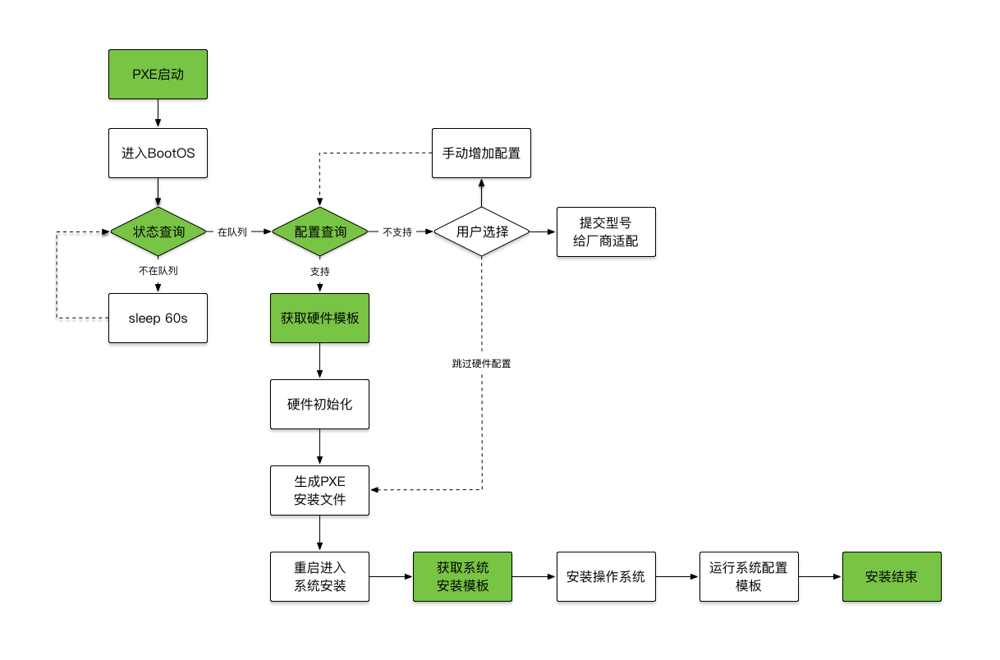

# 系统安装流程

系统安装用户流程图如下：

1. 由用户通过前台UI录入数据，提交物理机安装请求
2. 接着需要用户手工或者通过oob接口从网络启动服务器
3. 网络启动默认会进入BootOS，并自动启动内置的agent
4. agent会根据自身序列号去server端查询是否在安装队列中
5. 如果不在安装队列，则sleep 60秒，然后继续查询
6. 进入安装队列以后，根据自身硬件型号查询是否支持配置
7. 如果不支持硬件配置，则提示给用户来进一步处理
8. 接下来agent会获取硬件配置模板，并执行具体的配置内容
9. 然后agent会上报网卡mac地址，通知server端生成pxe安装文件
10. 最后agent会强制从网络启动服务器，并进入系统安装流程
11. 进入系统安装以后，首先获取自动化安装配置文件
12. 然后安装操作系统，并运行系统初始化post脚本
13. 最终上报消息和进度通知server端安装完成，重启进入系统

